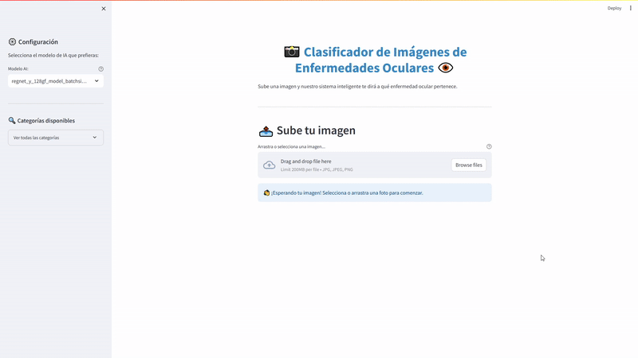

# Práctica Imagen ADNE

This project focuses on image classification using CNNs (Convolutional Neural Networks) with PyTorch and Streamlit. It includes a series of Jupyter notebooks exploring classical ML, deep learning, and commercial pre-trained models. The app visualizes training performance and allows user interaction through a web interface.



## 📁 Project Structure

```
PracticaImagen/
├── models/                                # Trained model logs/checkpoints
│   ├── regnet_y_128gf_model_*.txt
│   ├── resnet50_model_*.txt
│   ├── resnext101_64x4d_model_*.txt
│   └── resnext50_32x4d_model_*.txt
├── src/
│   ├── 1. EDA.ipynb                        # Exploratory Data Analysis
│   ├── 2. ML.ipynb                         # Traditional Machine Learning
│   ├── 3. DL.ipynb                         # Deep Learning from scratch
│   ├── 4. Commercial Models.ipynb          # Pretrained/commercial CNNs
│   ├── cnn.py                              # CNN class with training logic
│   └── plts/                               # Evaluation plots and metrics
│       └── <model_name>/                  
│           ├── accuracy.png
│           ├── loss.png
│           ├── confusion_matrix.png
│           ├── confusion_matrix_raw.csv
│           └── classification_report.csv
├── streamlit/
│   ├── app/app.py                          # Streamlit web interface
│   └── img/icai.png                        # ICAI logo
├── requirements.txt                        # Python dependencies
└── README.md                               # Project documentation
```

## 🚀 Features

- Modular CNN wrapper over pretrained models (e.g., ResNet, RegNet, ResNeXt)
- Clear separation of EDA, classical ML, DL, and pretrained model experiments
- Performance visualizations (loss, accuracy, confusion matrix, metrics)
- Interactive UI using Streamlit
- Easily extendable for additional architectures or datasets

## 🛠️ Installation

```bash
git clone https://github.com/Guillermo-Velasco-Orihuela/PracticaImagen.git
cd PracticaImagen
python -m venv venv
source venv/bin/activate  # Windows: venv\Scripts\activate
pip install -r requirements.txt
```

## ▶️ Usage

To explore the project step by step, open and run the notebooks in `src/`:

- `1. EDA.ipynb`: Dataset analysis
- `2. ML.ipynb`: Traditional classifiers
- `3. DL.ipynb`: Custom CNN training
- `4. Commercial Models.ipynb`: Transfer learning with pretrained models

To launch the **Streamlit** interface (after preparing the models — see below):

```bash
streamlit run streamlit/app/app.py
```

## ⚠️ Streamlit App Usage Notes

The **Streamlit interface only works with the pretrained commercial models** (e.g., ResNet, RegNet, ResNeXt). It does **not** support models trained from scratch.

To use the app:

1. Navigate to the `models/` directory.
2. Open the `.txt` file corresponding to the model you want to use.
3. Follow the download link inside the `.txt` file to obtain the pretrained model checkpoint.
4. Save the downloaded file in the **same `models/` folder**.
5. Then, run the Streamlit app:

   ```bash
   streamlit run streamlit/app/app.py
   ```

The app will automatically detect the downloaded models if they are named and located correctly.

## 🧠 Model Overview

- Uses transfer learning with a custom classification head
- Evaluation includes accuracy/loss plots, confusion matrices, and CSV reports
- Training logic and architecture abstraction are handled in `cnn.py`

## 📦 Requirements

Main packages include:

- PyTorch
- Torchvision
- Streamlit
- Matplotlib
- Pandas
- Scikit-learn

(See `requirements.txt` for the full list)
